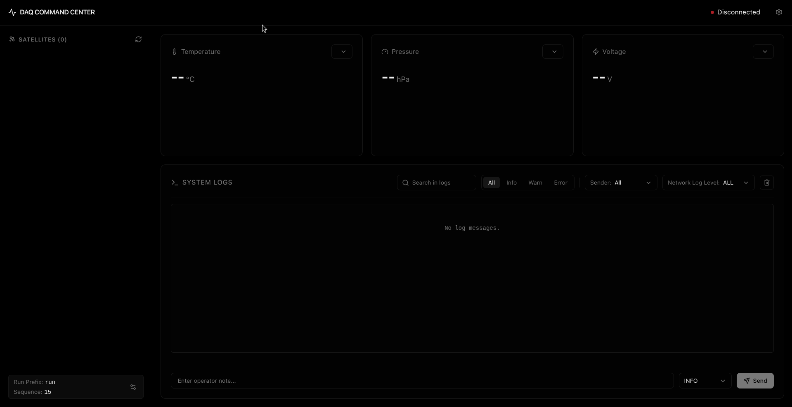
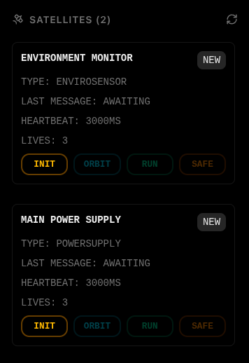
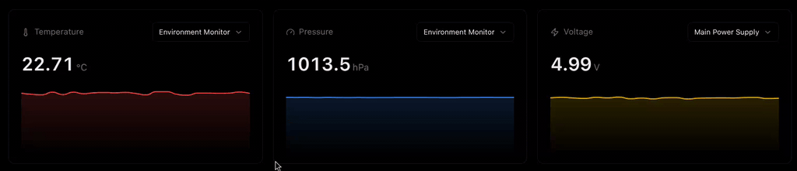
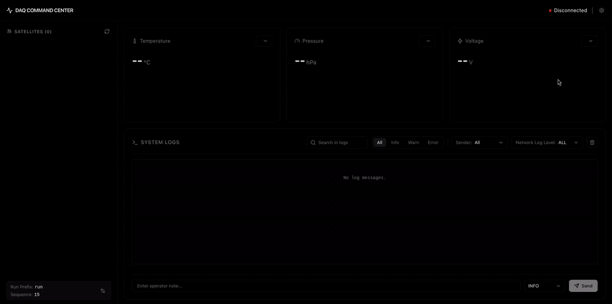

# DAQ Command Center

## About the Project

DAQ Command Center is a web-based control interface for data acquisition (DAQ) systems in high energy physics. The project is inspired by the Constellation ecosystem (MissionControl and Observatory interfaces).

The main design idea is to help operators understand complex system states quickly and clearly at a glance. The frontend is built with Svelte 5, focusing on performance and simplicity. On the backend, a Python and WebSocket-based asynchronous server provides continuous data flow.

<p align="center">

</p>

## Core Features

### Connection and Interface

When the application starts, the user sees the main control panel. On the left side, there is a list of devices. On the right side, there are data graphs and system logs.

To start data flow, the user enters host and port information from the settings menu in the top-right corner and sends a WebSocket connection request. If the connection fails, the system shows an error message.

<p align="center">

</p>

If the network parameters are correct and the server is reachable, the interface updates with a success message. After that, the operator can monitor the system from the main screen.

<p align="center">

</p>

### FSM (Finite State Machine) and Device Management

The safety of system devices is not based on random external rules. Instead, each component follows its own Finite State Machine (FSM).

After connecting to the server, the system loads the list of devices on the network and their current FSM states.

<p align="center">

</p>

This structure is integrated in Python using the `statemachine` library. State transitions are strictly controlled.

To manage devices safely, the required FSM steps must be followed.

<p align="center">

</p>

For example, a device in the `INIT` state cannot directly move to the `RUN` state. It must first go to the `ORBIT` state.

Invalid transitions are automatically disabled in the interface. Operators can manage state changes directly from the UI.

<p align="center">

</p>

### Real-Time Data Visualization

Sensors send data only when the system is in the `RUN` state. This ensures that data flow is synchronized with system state.

Incoming data is visualized using Apache ECharts with high performance.

<p align="center">

</p>

Data types depend on the hardware. For example:

- `EnviroSensor` provides temperature and pressure data
- `PowerSupply` provides voltage values

Each graph stores a maximum of 30 data points to prevent memory issues. When the limit is reached, the oldest data is removed (FIFO) and new data is added.

The data source can be changed instantly from the top-right menu.

### System Logs

All system events, data movements, and state changes can be tracked from the log panel at the bottom-right.

<p align="center">

</p>

For performance reasons, a maximum of 1000 log entries are stored on screen.

This module includes:

- **Client-side filtering:** Case-sensitive search with filters by log level and source
- **Server-side filtering (Network Log Level):** Only selected log levels are sent from the server to reduce network load
- **Interactive log generation:** Users can send log messages manually through the UI. These messages go to the server and come back to verify data integrity

### Application Flow

The full system workflow, including all components working together, is summarized below.

The operator can control everything from a single screen.

<p align="center">

</p>

## Roadmap

- **Network Discovery:** Dynamically scan and add new devices to the system using the refresh button
- **Configuration Management:** Make features like "Run Prefix" and "Sequence" functional
- Fix bugs on UI and server sides, and improve performance

## Usage

To run the project fully, both the frontend (Svelte) and backend (Python WebSocket server) must run at the same time.

Requirements:

- Node.js
- Python
- Git

### Clone the Project

```bash
git clone https://github.com/cysctl/daq-command-center.git
cd daq-command-center
```

### Backend Setup

Go to the "server" folder:

```bash
cd server
```

It is recommended to use a virtual environment:

```bash
python -m venv venv
source venv/bin/activate # Linux
```

Install dependencies and start the server:

```bash
pip install -r requirements.txt
python server.py
```

The server will start listening on the local network.

### Frontend Setup

Open a new terminal and stay in the root directory. Install dependencies and start the development server:

```bash
npm install
npm run dev
```

If port 5173 is available, the app will run at:

[http://localhost:5173](http://localhost:5173)

Open this address in your browser and enter WebSocket settings from the top-right menu to start using the system.

## AI Usage Policy

AI tools were used in this project according to the following principles:

- **Design and Architecture:** The main architecture, FSM logic, Svelte 5 frontend, and Python WebSocket integration were designed and implemented manually
- **Code Generation:** GitHub Copilot was used as a coding assistant, but all logic was reviewed and adapted
- **Documentation:** Large Language Models (LLMs) were used to improve the clarity and professionalism of this README

## License

This project is licensed under the MIT License. See the [LICENSE](LICENSE) file for more details.
