# DAQ Command Center

## About the Project

DAQ Command Center is a web-based control interface for data acquisition (DAQ) systems in high energy physics. The project is inspired by the Constellation ecosystem (MissionControl and Observatory interfaces).

The main design idea is to help operators understand complex system states quickly and clearly at a glance. The frontend is built with Svelte 5, focusing on performance and simplicity. On the backend, a Python and WebSocket-based asynchronous server provides continuous data flow.

<p align="center">
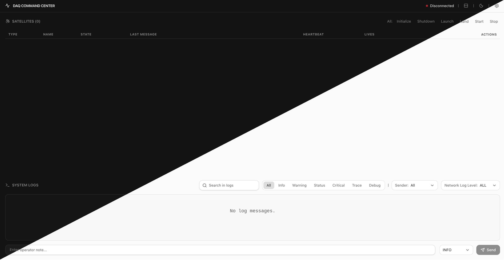
</p>

## Core Features

### Connection and Interface

When the application starts, the user sees the main control panel. On the top, there is a satellite table. On the bottom, there are system logs.

To start data flow, the user enters host and port information from the settings menu in the top-right corner and sends a WebSocket connection request. If the connection fails, the system shows an error message.

<p align="center">
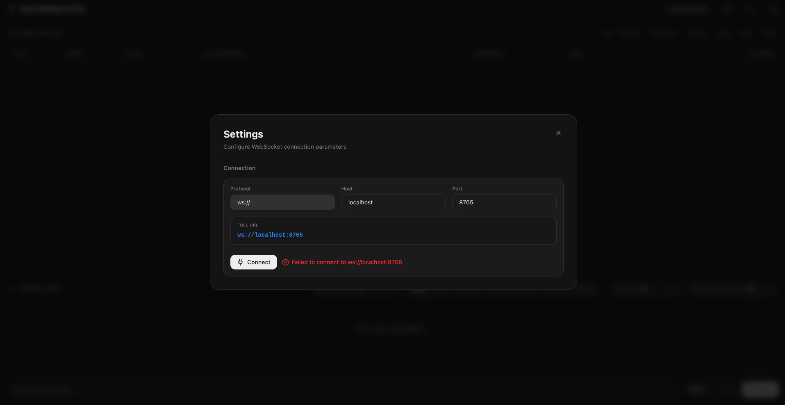
</p>

If the network parameters are correct and the server is reachable, the interface updates with a success message. After that, the operator can monitor the system from the main screen.

<p align="center">
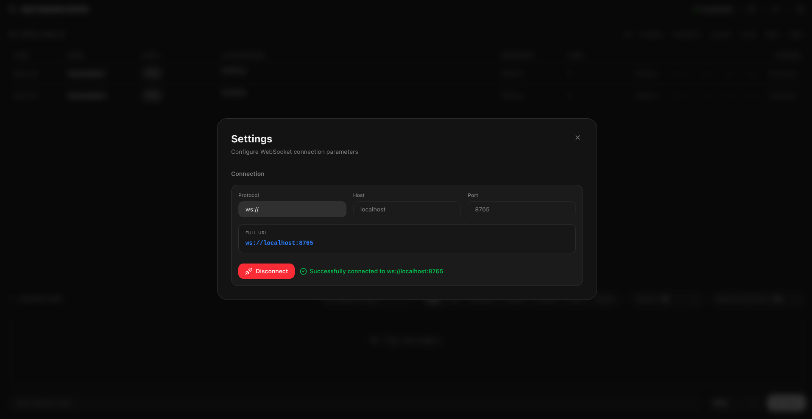
</p>

### Theme

The application supports both dark and light themes. The user can switch between themes using the toggle button in the header. The dark theme uses a deep, low-contrast color palette designed for extended monitoring sessions. The light theme provides a clean, high-contrast alternative for well-lit environments.

Each FSM state has its own distinct color in both themes, making it easy to identify system status at a glance.

<p align="center">
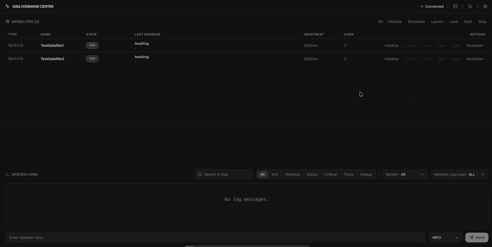
</p>

### Customizable Layout

The operator can choose between two layout modes using the split screen button in the header:

- **Horizontal split (default):** Satellite table on top, system logs on the bottom.
- **Vertical split:** Satellite table on the left, system logs on the right.

This allows operators to adjust the interface based on their screen size, workflow, or personal preference.

<p align="center">

</p>

### FSM (Finite State Machine) and Device Management

The safety of system devices is not based on random external rules. Instead, each component follows its own Finite State Machine (FSM).

After connecting to the server, the system loads the list of devices on the network and their current FSM states.

This structure is integrated in Python using the `statemachine` library. State transitions are strictly controlled.

The FSM defines six main states:

| State   | Description                                  |
| ------- | -------------------------------------------- |
| `NEW`   | Initial state when a satellite first appears |
| `INIT`  | Initialized and ready for configuration      |
| `ORBIT` | Configured and ready for data acquisition    |
| `RUN`   | Actively acquiring data                      |
| `SAFE`  | Safe mode, triggered by rule violations      |
| `ERROR` | Error state, triggered by hardware failures  |

To add realism and reflect real-world hardware behavior, six **transitional states** are introduced between main states. When a command is issued, the satellite first enters a transitional state (e.g. `INITIALIZING`, `LAUNCHING`) before reaching its target state. During this transition, a spinning indicator is displayed on the state badge and all commands are disabled until the transition completes. Each transition takes 1.5 seconds.

| Transitional State | From           | To      |
| ------------------ | -------------- | ------- |
| `INITIALIZING`     | `NEW` / `INIT` | `INIT`  |
| `LAUNCHING`        | `INIT`         | `ORBIT` |
| `LANDING`          | `ORBIT`        | `INIT`  |
| `RECONFIGURING`    | `ORBIT`        | `ORBIT` |
| `STARTING`         | `ORBIT`        | `RUN`   |
| `STOPPING`         | `RUN`          | `ORBIT` |

Satellites in `SAFE` or `ERROR` states can be recovered back to the `INIT` state using the `Initialize` command.

<p align="center">
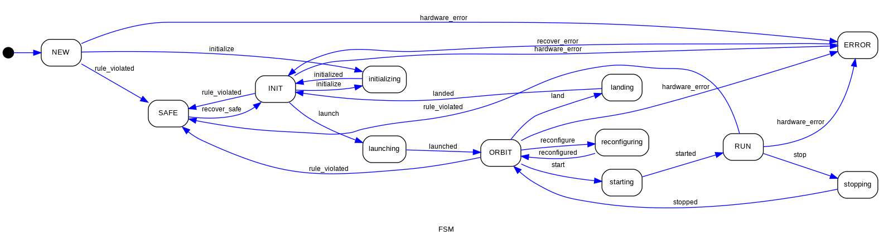
</p>

### Satellite Table

Satellites are displayed in a structured table with the following columns:

| Column           | Description                              |
| ---------------- | ---------------------------------------- |
| **Type**         | Hardware type of the satellite           |
| **Name**         | Unique identifier                        |
| **State**        | Current FSM state with color-coded badge |
| **Last Message** | Most recent message with timestamp       |
| **Heartbeat**    | Heartbeat interval (e.g. `3000ms`)       |
| **Lives**        | Remaining lives counter                  |
| **Actions**      | Available command buttons                |

Horizontal layout:

<p align="center">
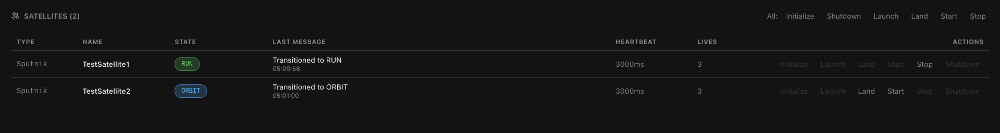
</p>
Vertical layout:

<p align="center">
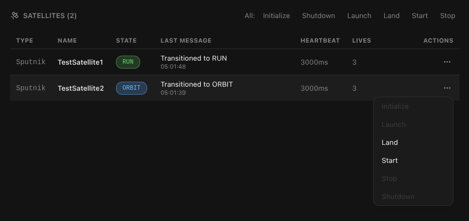
</p>

### Satellite Commands

Instead of directly selecting a target state (e.g. `INIT`, `ORBIT`, `RUN`), operators issue **action commands** that describe the operation to be performed. The available commands are:

| Command        | Transition                                     |
| -------------- | ---------------------------------------------- |
| **Initialize** | `NEW` / `SAFE` / `ERROR` → `INIT`              |
| **Launch**     | `INIT` → `ORBIT`                               |
| **Land**       | `ORBIT` → `INIT`                               |
| **Start**      | `ORBIT` → `RUN`                                |
| **Stop**       | `RUN` → `ORBIT`                                |
| **Shutdown**   | Removes the satellite from the system entirely |

Invalid commands are automatically disabled based on the satellite's current state. During transitional states, all commands are disabled.

<p align="center">
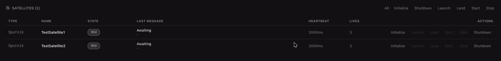
</p>

#### Global Control

A set of quick action buttons is provided above the satellite table, labeled **"All:"**. These buttons send a command to every satellite simultaneously. This allows operators to initialize, launch, start, stop, land, or shut down all devices with a single click.

<p align="center">
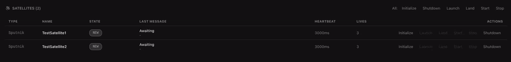
</p>

#### Context Menu (Vertical Layout)

In vertical split mode, screen space for the table is limited. To maintain a clean layout, per-satellite command buttons are replaced with a compact context menu. Clicking the ellipsis icon (`...`) at the end of a table row opens a small popup right next to the cursor, similar to a right-click context menu on a desktop. The popup lists all available commands with the same enable/disable logic.

<p align="center">
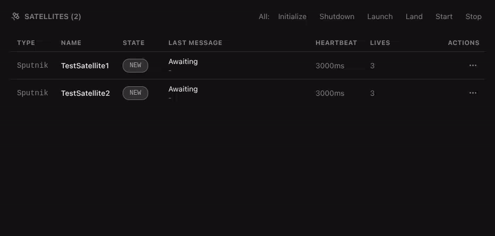
</p>

### System Logs

All system events, data movements, and state changes can be tracked from the log panel.

Log messages are color-coded by level for quick visual scanning:

| Level      | Color                   |
| ---------- | ----------------------- |
| `INFO`     | Blue                    |
| `STATUS`   | Green (highlighted row) |
| `WARNING`  | Amber (highlighted row) |
| `CRITICAL` | Red (highlighted row)   |
| `TRACE`    | Purple                  |
| `DEBUG`    | Muted                   |

For performance reasons, a maximum of 1000 log entries are stored on screen. When the limit is reached, the oldest entries are removed (FIFO).

<p align="center">
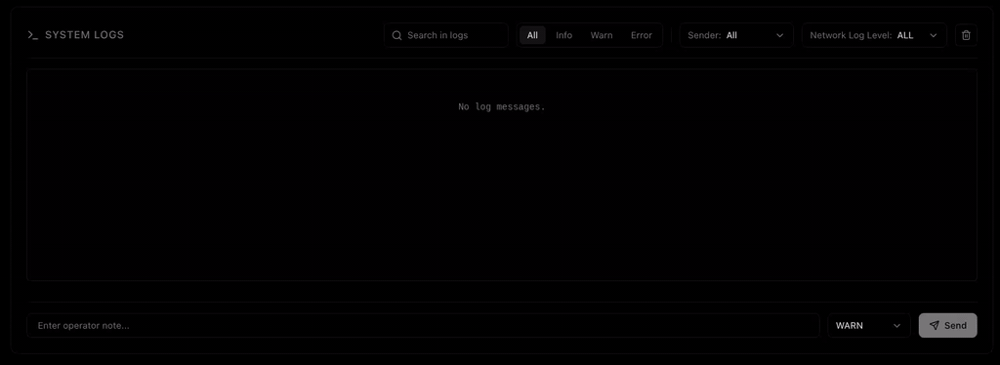
</p>

This module includes:

- **Interactive log generation:** Users can send log messages manually through the UI by writing an operator note and selecting a log level. These messages go to the server and come back to verify data integrity.

### Filters

The log panel provides multiple filtering options to help operators focus on relevant information:

- **Log Level Filter (Client-side):** Instantly filter logs by level — `All`, `Info`, `Warning`, `Status`, `Critical`, `Trace`, or `Debug`.
- **Search Filter (Client-side):** Free-text search to find specific log messages.
- **Sender Filter (Client-side):** Filter logs by source — `All`, `OP` (operator), or any specific satellite name.
- **Network Log Level (Server-side):** Controls which log levels the server sends to the client. This reduces network traffic by filtering at the source.

All client-side filters apply instantly without server communication. They can be combined together for precise filtering.

## Roadmap

- **Network Discovery:** Dynamically scan and add new devices to the system using the refresh button
- **Configuration Management:** Make features like "Run Prefix" and "Sequence" functional
- **Log Management:** Reintroduce the ability to clear the log screen
- **Bug Fixes & Improvements:** Fix UI and server-side issues, and improve overall performance
- **Log Filtering Fixes:** Resolve inconsistencies such as logs appearing under "System" without an available sender filter, and identify/fix similar issues
- **State Handling Improvements:** Make transitions to SAFE/ERROR states more intelligent and reliable

## Usage

To run the project fully, both the frontend (Svelte) and backend (Python WebSocket server) must run at the same time.

Requirements:

- Node.js
- Python
- Git

### Clone the Project

```bash
git clone https://github.com/cysctl/daq-command-center.git
cd daq-command-center
```

### Backend Setup

Go to the "server" folder:

```bash
cd server
```

It is recommended to use a virtual environment:

```bash
python -m venv venv
source venv/bin/activate # Linux
```

Install dependencies and start the server:

```bash
pip install -r requirements.txt
python server.py
```

The server will start listening on the local network.

### Frontend Setup

Open a new terminal and stay in the root directory. Install dependencies and start the development server:

```bash
npm install
npm run dev
```

If port 5173 is available, the app will run at:

[http://localhost:5173](http://localhost:5173)

Open this address in your browser and enter WebSocket settings from the top-right menu to start using the system.

## AI Usage Policy

AI tools were used in this project according to the following principles:

- **Design and Architecture:** The main architecture, FSM logic, Svelte 5 frontend, and Python WebSocket integration were designed and implemented manually
- **Code Generation:** GitHub Copilot and Claude Code were used as coding assistants, but all logic was reviewed and adapted
- **Documentation:** Large Language Models (LLMs) were used to improve the clarity and professionalism of this README

## License

This project is licensed under the MIT License. See the [LICENSE](LICENSE) file for more details.
